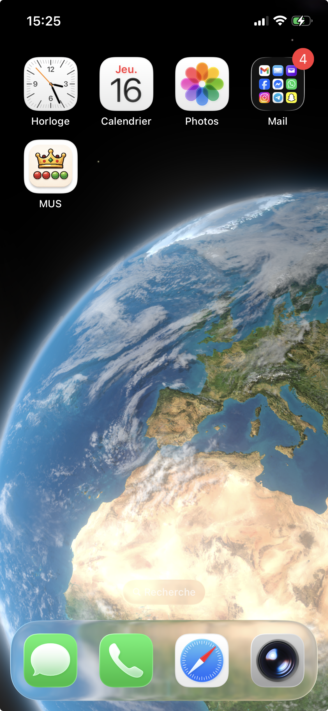
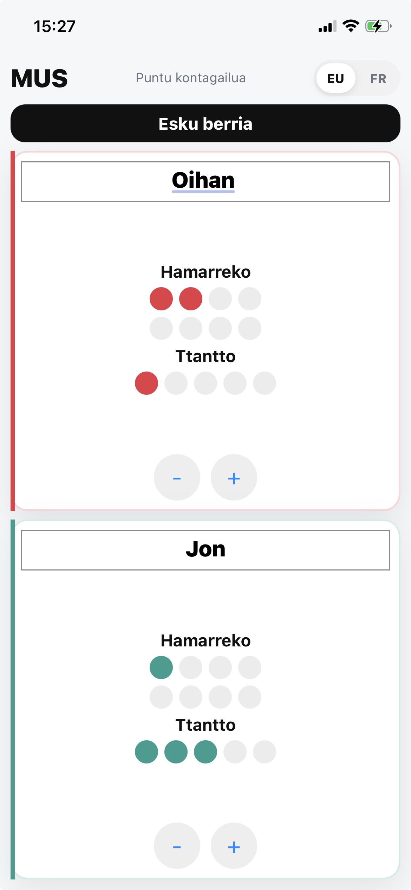

# MUS Score App

Application web pour compter facilement les points au jeu de cartes basque **Mus**.

👉 Pensée pour être utilisée **n’importe où**, même sans matériel pour compter les points.

## 📱 Aperçu

<p align="center">
  
  
</p>

---

## 🚀 Démo

👉 https://alfaro-b.github.io/mus-score-app/

---

## ✨ Fonctionnalités

- Comptage des **ttantto** et **hamarreko**
- Conversion automatique (5 ttantto = 1 hamarreko)
- Détection automatique de la victoire (8 hamarreko)
- Animation de victoire avec confettis 🎉
- Noms d’équipes personnalisables
- Interface **mobile-first et responsive**
- Support du mode paysage
- Sauvegarde automatique de la partie (localStorage)
- Multilingue (EU / FR)
- Installable comme une app (PWA)

---

## 📱 Installation (PWA)

Tu peux installer l’app sur ton téléphone :

1. Ouvre le lien dans ton navigateur
2. Clique sur **"Ajouter à l’écran d’accueil"**
3. Lance l’app comme une application classique

---

## 🛠️ Tech

- HTML / CSS / JavaScript
- Vite
- Vite Plugin PWA
- GitHub Pages (déploiement)

---

## ⚙️ Développement

Lancer le projet en local :

```bash
npm install
npm run dev
```

---

## 📦 Build

Générer la version de production :

```bash
npm run build
```

Prévisualiser le build localement :

```bash
npm run preview
```

---

## 🚀 Déploiement

Le projet est déployé automatiquement via **GitHub Pages**.

À chaque push sur la branche main :

1. GitHub Actions installe les dépendances
2. Lance le build (npm run build)
3. Publie le contenu du dossier dist

Aucune action manuelle n’est nécessaire.

---

## 🎯 Objectif

Proposer une solution simple et fiable pour compter les points au Mus dans toutes les situations, même lorsque l’on ne dispose pas de ttantto physiques.

L’application vise à reproduire une expérience de comptage naturelle, rapide et accessible depuis un smartphone, sans contrainte matérielle.
